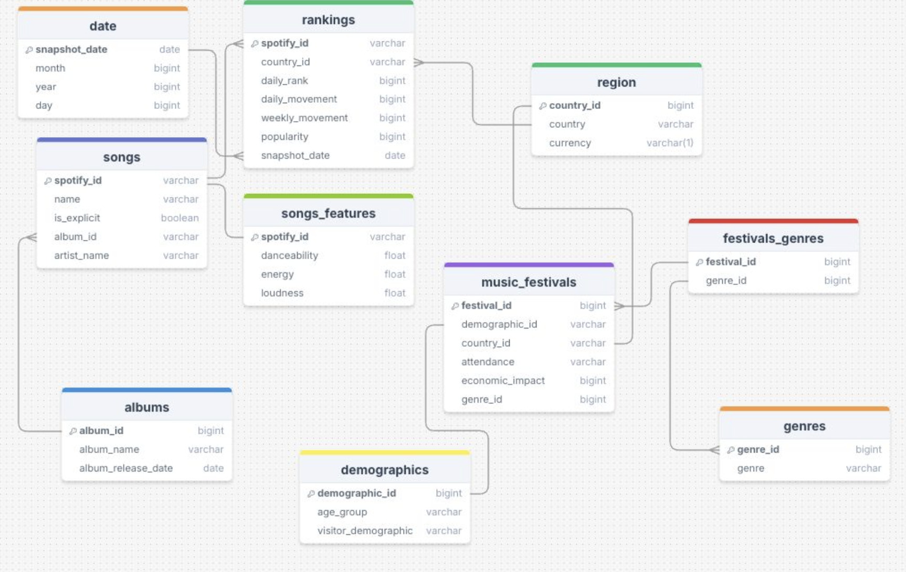

# 🎧 From Streams to Stages: Spotify Trends & Music Festival Strategy

This project explores the intersection of streaming behavior and live event planning by analyzing Spotify’s top songs across Europe and aligning them with market data on music festivals. The goal is to uncover genre gaps, audience preferences, and regional opportunities to help organizers, artists, and marketers plan high-impact festivals backed by data.

---

## 🎯 Project Goal

To identify the most promising countries, genres, and artist types for launching a new music festival in Europe by:

- Analyzing genre trends, artist performance, and streaming behavior from Spotify data
- Mapping user preferences to real-world festival activity and economic indicators
- Recommending target markets, genres, and promotional strategies for festival success

---

## 💡 Business Opportunity

Music festivals are a cultural and economic force, but success depends on aligning with what people *want to hear*. This project empowers stakeholders to:

- Curate artist lineups based on **genre demand** and **audience behavior**
- Identify **white space opportunities** in saturated or emerging festival markets
- Maximize ROI by targeting the right countries with the right sound

---

## 📊 Datasets Used

### 🎵 Top Spotify Songs Dataset
- Source: [Kaggle](https://www.kaggle.com/datasets/asaniczka/top-spotify-songs-in-73-countries-daily-updated/data)
- Scope: Daily top 50 songs across **73 countries**
- Records: 1.6M+ rows, 25 columns
- Key fields: `spotify_id`, `name`, `artist_name`, `country`, `daily_rank`, `popularity`, `danceability`, `energy`, `loudness`, `snapshot_date`, etc.
- Preprocessing steps:
  - Filtered for **Europe** only
  - Retained only **top 20** ranked songs per country per day
  - Mapped country codes to full names and continents
  - Extracted date parts and removed nulls
  - Joined audio features and normalized fields

### 🎪 Music Festivals 2024 Dataset
- Source: [Kaggle](https://www.kaggle.com/datasets/gorororororo23/aereregre/data)
- Records: 205 festivals in Europe & globally
- Fields: `festival_name`, `location`, `attendance`, `visitor_demographics`, `economic_impact`, `music_genre`
- Preprocessing steps:
  - Cleaned `economic_impact` currency formats
  - Converted attendance fields to numeric
  - Harmonized country names (e.g., 'UK' → 'United Kingdom')
  - Assigned genre IDs and normalized genre types
  - Created relational joins for analysis by region, genre, and demographic

---

## 🧩 Database Design

To enable scalable and relational analysis, all datasets were transformed into a **MySQL database schema**, structured as follows:

### ✅ Key Tables:
- `songs`: Basic track info  
- `songs_features`: Spotify audio attributes  
- `rankings`: Daily performance by country  
- `albums`: Linked to tracks  
- `music_festivals`: Festival profiles (attendance, impact, demographics)  
- `genres`, `festivals_genres`: Genre relationships  
- `region`: Country mapping and currency  
- `date`: Snapshot dimensions  
- `demographics`: Audience segments (e.g., Gen Z, young adults)

---

## 🔍 Key Findings

- **Pop**, **Electronic**, and **Indie** dominate the top charts across Europe, with artists like **Billie Eilish**, **Lady Gaga**, and **Sabrina Carpenter** leading in daily rankings.
- **Bad Bunny** and **GIMS** reflect growing interest in **Latin** and **Francophone** music, especially in **Spain**, where these genres are underrepresented in current festival offerings.
- **Hungary’s Sziget Festival** accounts for **83% of the country’s total festival economic impact**, indicating a highly concentrated market with room for genre expansion or new niche festivals.
- Streaming features such as **danceability** and **energy** show strong listener preferences for **high-energy tracks**, especially in **Eastern European** countries — aligning well with **EDM**, **Hip-Hop**, and **Techno**.
- **ROSÉ** and other rising **K-pop artists** are gaining traction, signaling strong **Gen Z appeal** and potential for fan-driven promotion strategies.
- **Germany’s** listening behavior aligns closely with **Rock**, **Metal**, and **Techno**, confirming genre fit with existing festivals but also signaling saturation.
- **Belgium**, while home to **Tomorrowland**, presents a **mature and competitive market**, limiting the opportunity for new players.
- A clear **genre diversity gap** exists between what users stream and what most festivals offer — especially for **Latin**, **Urban**, and **Alt-pop** genres.
- Listener engagement metrics (e.g., **daily rank consistency** and **weekly movement**) indicate **loyal fanbases**, useful for **artist booking** decisions.
- While the **UK** has high economic impact, the **market is saturated**, reducing its attractiveness for launching new festivals compared to **Hungary** and **Spain**, which present stronger opportunity-to-competition ratios.

---

## 📍 Recommended Festival Locations

### 🇭🇺 **Hungary**  
High demand for **high-energy music** (EDM, Hip Hop, Techno), strong local festival economy, and opportunity to diversify existing offerings.

### 🇪🇸 **Spain**  
Underserved in **Latin Trap**, **Reggaeton**, and Urban music. Opportunity for a genre-specific festival to capture both local and international audiences.

---

## 🚀 Next Steps

- **Promotion & Marketing Strategy**  
  Leverage short-form content (TikTok, Reels), influencer partnerships, and Spotify playlists to generate hype.

- **Ticketing Strategy**  
  Dynamic pricing models: **Early bird**, **VIP**, and **group discounts** to boost conversions.

- **Future Expansion**  
  Integrate social listening data (Twitter, TikTok trends), artist tour data, and real-time ticketing APIs.

---

## 🛠️ Tools & Technologies

- **Python**: pandas, matplotlib.pyplot, plotly.express, seaborn
- **SQL**: MySQL / SQLite for structured data modeling  

---

## ✨ About the Author

- **Rebecca Woo**  
  Business & Data Analyst | Where Data Meets Design  
---

